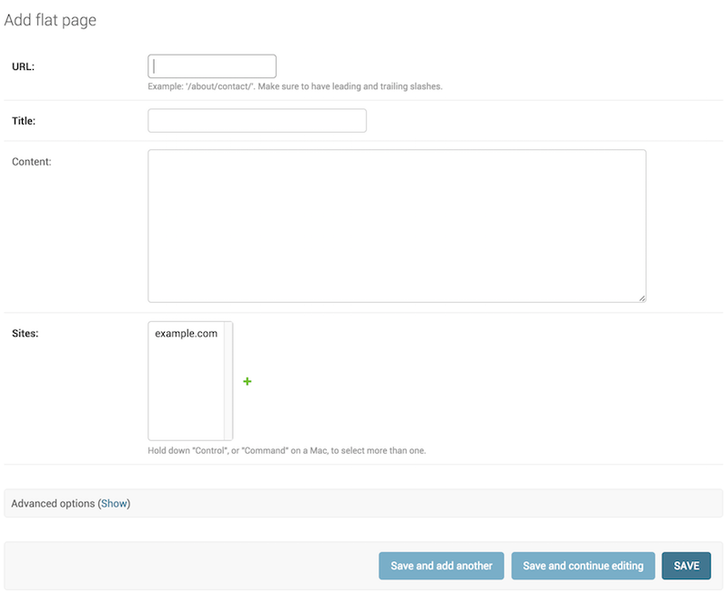

# Django admin site
One of the most powerful parts of Django is the automatic admin interface. It reads metadata from your models to provide a quick, model-centric interface where trusted users can manage content on your site.

##  ModelAdmin objects
1. ### class ModelAdmin
    The ModelAdmin class is the representation of a model in the admin interface. Usually, these are stored in a file named admin.py in your application.
    ```
   from django.contrib import admin
    from myapp.models import Question

    class QuestionAdmin(admin.ModelAdmin):
        pass
    admin.site.register(Question, QuestionAdmin)
   ```
2. ### The register decorator
       register(*models, site=django.contrib.admin.sites.site)
    There is also a decorator for registering your ModelAdmin classes:
    ```
   from django.contrib import admin
    from .models import Question

    @admin.register(Question)
    class QuestionAdmin(admin.ModelAdmin):
          pass
   ```
3. ### ModelAdmin.list_filter
    Set list_filter to activate filters in the right sidebar of the change list page of the admin


4. ### ModelAdmin.search_fields
    Set search_fields to enable a search box on the admin change list page. This should be set to a list of field names that will be searched whenever somebody submits a search query in that text box.
    ```
   search_fields = ['question']
   ```

5. ### ModelAdmin options
   The ModelAdmin is very flexible. It has several options for dealing with customizing the interface. All options are defined on the ModelAdmin subclass:
   ```
   from django.contrib import admin
   class QuestionAdmin(admin.ModelAdmin):
       date_hierarchy = 'pub_date'
   ```
6. ### ModelAdmin.exclude
    This attribute, if given, should be a list of field names to exclude from the form.
    For example, let’s consider the following model:
    ```
   from django.db import models
    class Author(models.Model):
    name = models.CharField(max_length=100)
    title = models.CharField(max_length=3)
    birth_date = models.DateField(blank=True, null=True)
   ```
    If you want a form for the Author model that includes only the name and title fields, you would specify fields or exclude like this:
    ```
   from django.contrib import admin

    class AuthorAdmin(admin.ModelAdmin):
         fields = ('name', 'title')

    class AuthorAdmin(admin.ModelAdmin):
         exclude = ('birth_date',)
   ```

    Since the Author model only has three fields, name, title, and birth_date, the forms resulting from the above declarations will contain exactly the same fields.
7. ### ModelAdmin.list_display
    Set list_display to control which fields are displayed on the change list page of the admin.
    ```
   list_display = ('first_name', 'last_name')
   ```
    If you don’t set list_display, the admin site will display a single column that displays the __str__() representation of each object.

    There are four types of values that can be used in list_display. All but the simplest may use the display() decorator, which is used to customize how the field is presented:

    The name of a model field. For example:
    ```
   class PersonAdmin(admin.ModelAdmin):
       list_display = ('first_name', 'last_name')
   ```

8. ### ModelAdmin.fields 
    Use the fields option to make simple layout changes in the forms on the “add” and “change” pages such as showing only a subset of available fields, modifying their order, or grouping them into rows. For example, you could define a simpler version of the admin form for the django.contrib.flatpages.models.FlatPage model as follows:
    ```
   class FlatPageAdmin(admin.ModelAdmin):
       fields = ('url', 'title', 'content')
   ```

9. ### ModelAdmin.fieldsets
    Set fieldsets to control the layout of admin “add” and “change” pages.

    fieldsets is a list of two-tuples, in which each two-tuple represents a fieldset on the admin form page.

    The two-tuples are in the format (name, field_options), where name is a string representing the title of the fieldset and field_options is a dictionary of information about the fieldset, including a list of fields to be displayed in it.

    Example
    ```
   from django.contrib import admin

    class FlatPageAdmin(admin.ModelAdmin):
        fieldsets = (
           (None, {
            'fields': ('url', 'title', 'content', 'sites')
           }),
           ('Advanced options', {
              'classes': ('collapse',),
              'fields': ('registration_required', 'template_name'),
           }),
      )
   ```

This results in an admin page that looks like:
