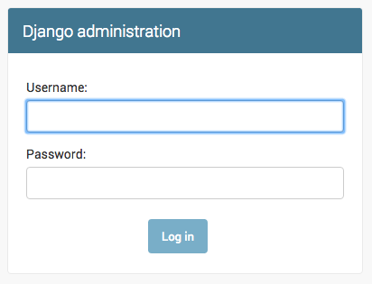
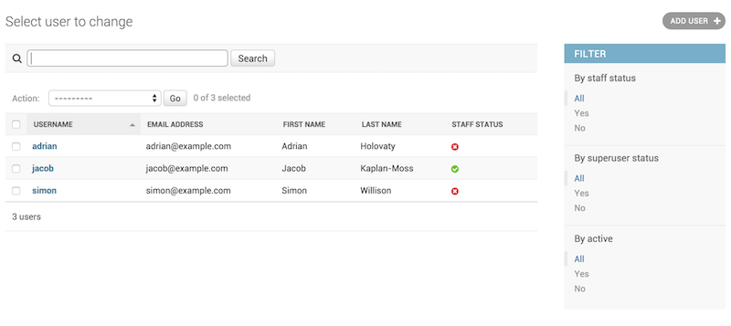

# Django admin site
One of the most powerful parts of Django is the automatic admin interface. It reads metadata from your models to provide a quick, model-centric interface where trusted users can manage content on your site.

##  ModelAdmin objects
1. ### class ModelAdmin
    The ModelAdmin class is the representation of a model in the admin interface. Usually, these are stored in a file named admin.py in your application.
    ```
   from django.contrib import admin
    from myapp.models import Question

    class QuestionAdmin(admin.ModelAdmin):
        pass
    admin.site.register(Question, QuestionAdmin)
   ```
2. ### The register decorator
       register(*models, site=django.contrib.admin.sites.site)
    There is also a decorator for registering your ModelAdmin classes:
    ```
   from django.contrib import admin
    from .models import Question

    @admin.register(Question)
    class QuestionAdmin(admin.ModelAdmin):
          pass
   ```
3. ### ModelAdmin.list_filter
    Set list_filter to activate filters in the right sidebar of the change list page of the admin


4. ### ModelAdmin.search_fields
    Set search_fields to enable a search box on the admin change list page. This should be set to a list of field names that will be searched whenever somebody submits a search query in that text box.
    ```
   search_fields = ['question']
   ```